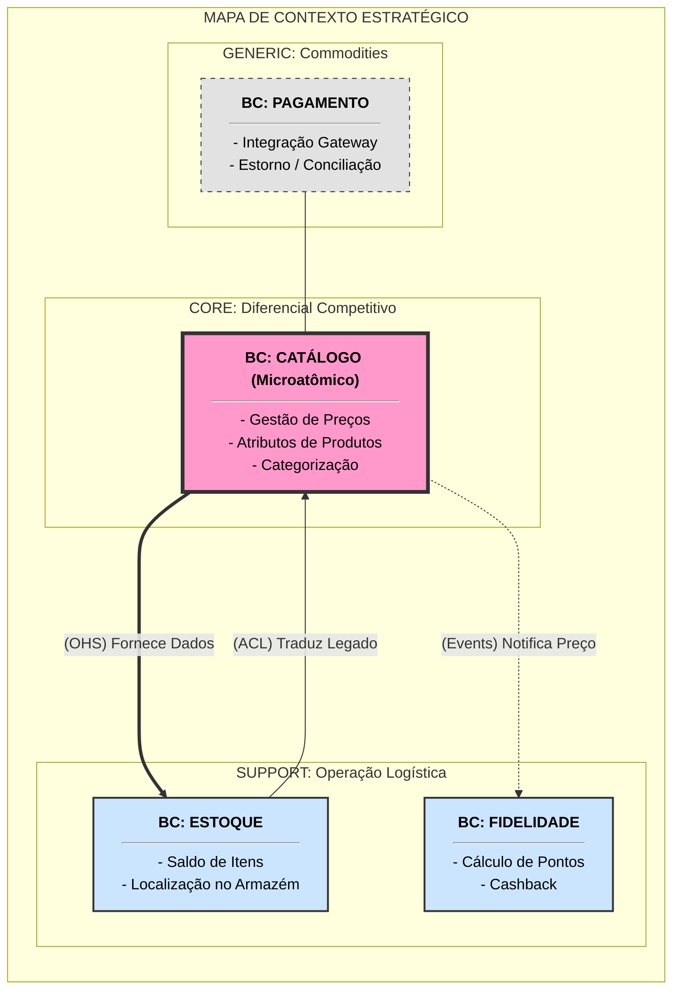

```mermaid
graph LR
    %% Definição de Estilos
    classDef core fill:#ff99cc,stroke:#333,stroke-width:4px,color:#000
    classDef support fill:#cce5ff,stroke:#333,stroke-width:2px,color:#000
    classDef generic fill:#e2e2e2,stroke:#333,stroke-dasharray: 5 5,color:#000

    subgraph ECOMMERCE_SYSTEM [MAPA DE CONTEXTO ESTRATÉGICO]
        direction TB

        %% Detalhando o Core Domain com foco no Microatômico
        subgraph CORE [CORE: Diferencial Competitivo]
            CATALOGO["<b>BC: CATÁLOGO (Microatômico)</b><hr/>- Gestão de Preços<br/>- Atributos de Produtos<br/>- Categorização"]
        end

        %% Detalhando os Subdomínios de Suporte
        subgraph SUPPORT [SUPPORT: Operação Logística]
            ESTOQUE["<b>BC: ESTOQUE</b><hr/>- Saldo de Itens<br/>- Localização no Armazém"]
            LOYALTY["<b>BC: FIDELIDADE</b><hr/>- Cálculo de Pontos<br/>- Cashback"]
        end

        %% Detalhando o Domínio Genérico
        subgraph GENERIC [GENERIC: Commodities]
            PAGAMENTO["<b>BC: PAGAMENTO</b><hr/>- Integração Gateway<br/>- Estorno / Conciliação"]
        end
    end

    %% Relacionamentos com labels claras que não obstruem os nomes
    CATALOGO ====>|"(OHS) Fornece Dados"| ESTOQUE
    ESTOQUE ---->|"(ACL) Traduz Legado"| CATALOGO
    CATALOGO -.->|"(Events) Notifica Preço"| LOYALTY
    PAGAMENTO --- CATALOGO
    
    %% Aplicação dos Estilos
    class CATALOGO core
    class ESTOQUE,LOYALTY support
    class PAGAMENTO generic
```