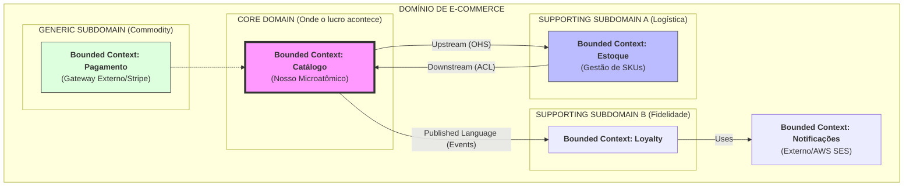

```mermaid
graph TD
    subgraph "DOMÍNIO DE E-COMMERCE"
        
        %% Core Domain
        subgraph "CORE DOMAIN (Onde o lucro acontece)"
            CATALOGO["<b>Bounded Context: Catálogo</b><br/>(Nosso Microatômico)"]
        end

        %% Supporting Subdomains
        subgraph "SUPPORTING SUBDOMAIN A (Logística)"
            ESTOQUE["<b>Bounded Context: Estoque</b><br/>(Gestão de SKUs)"]
        end

        subgraph "SUPPORTING SUBDOMAIN B (Fidelidade)"
            LOYALTY["<b>Bounded Context: Loyalty</b>"]
        end

        %% Generic Subdomain
        subgraph "GENERIC SUBDOMAIN (Commodity)"
            PAGAMENTO["<b>Bounded Context: Pagamento</b><br/>(Gateway Externo/Stripe)"]
        end

        %% External Context
        EXT_NOTIF["<b>Bounded Context: Notificações</b><br/>(Externo/AWS SES)"]
    end

    %% Relacionamentos (Context Mapping)
    CATALOGO -- "Upstream (OHS)" --> ESTOQUE
    ESTOQUE -- "Downstream (ACL)" --> CATALOGO
    CATALOGO -- "Published Language (Events)" --> LOYALTY
    PAGAMENTO -.-> CATALOGO
    LOYALTY -- "Uses" --> EXT_NOTIF

    style CATALOGO fill:#f9f,stroke:#333,stroke-width:4px
    style ESTOQUE fill:#bbf,stroke:#333
    style PAGAMENTO fill:#dfd,stroke:#333
```