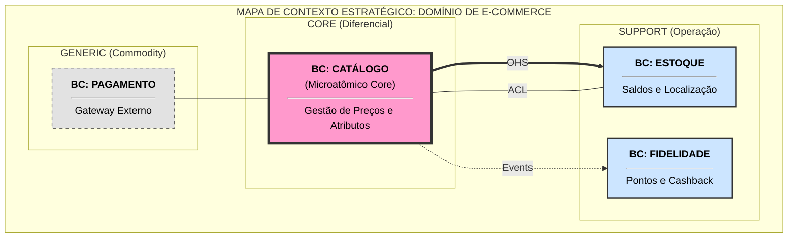

```mermaid
graph LR
    %% Definição de Estilos
    classDef core fill:#ff99cc,stroke:#333,stroke-width:4px,color:#000
    classDef support fill:#cce5ff,stroke:#333,stroke-width:2px,color:#000
    classDef generic fill:#e2e2e2,stroke:#333,stroke-dasharray: 5 5,color:#000

    subgraph STRATEGIC_MAP ["MAPA DE CONTEXTO ESTRATÉGICO: DOMÍNIO DE E-COMMERCE"]
        direction LR

        subgraph CORE ["CORE (Diferencial)"]
            CATALOGO["<b>BC: CATÁLOGO</b><br/>(Microatômico Core)<hr/>Gestão de Preços e Atributos"]
        end

        subgraph SUPPORT ["SUPPORT (Operação)"]
            ESTOQUE["<b>BC: ESTOQUE</b><hr/>Saldos e Localização"]
            LOYALTY["<b>BC: FIDELIDADE</b><hr/>Pontos e Cashback"]
        end

        subgraph GENERIC ["GENERIC (Commodity)"]
            PAGAMENTO["<b>BC: PAGAMENTO</b><hr/>Gateway Externo"]
        end
    end

    %% Relacionamentos com labels curtas para não poluir
    CATALOGO ===>|OHS| ESTOQUE
    ESTOQUE ---|ACL| CATALOGO
    CATALOGO -.->|Events| LOYALTY
    PAGAMENTO --- CATALOGO
    
    class CATALOGO core
    class ESTOQUE,LOYALTY support
    class PAGAMENTO generic
```