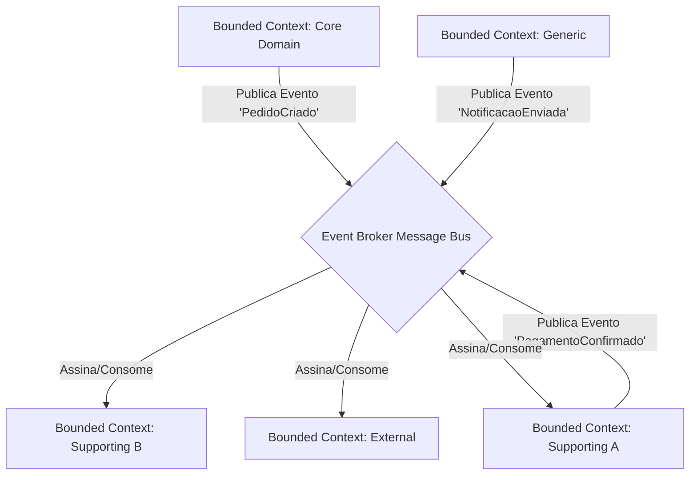

# WORKSHOP: Arquitetura Orientada a Eventos em Cenários de Alta Escala: Uma Análise de Padrões de Comunicação e Desacoplamento

⏱️ Workshop: EDA em Alta Escala (50 min)1. Ponto de Partida: Context Mapping (10 min)Utilizando a imagem fornecida como referência, traduzimos os domínios para um fluxo de eventos. O segredo da alta escala é o Desacoplamento Temporal: o emissor não espera o receptor.Mapeamento de Fluxo:Core Domain: Emite eventos vitais (ex: OrderPlaced).Supporting (A): Reage para processar pagamentos ou validações.Generic Subdomain: Cuida de tarefas transversais como Notificações ou Logs.External Context: Sistemas legados ou APIs de terceiros que consomem dados via Webhooks/Adapters.2. Análise de Padrões de Comunicação (15 min)Para escalar, analisamos dois modelos principais de interação entre esses contextos:PadrãoFuncionamentoNível de DesacoplamentoCoreografiaCada serviço observa o Broker e decide sua ação.Máximo. Não há ponto central de falha lógica.OrquestraçãoUm serviço central (Saga) comanda: "Execute A, depois B".Médio. Facilita a visão do processo, mas cria dependência do orquestrador.O Desafio da Alta Escala: IdempotênciaEm sistemas distribuídos, a rede falha. O padrão At-least-once delivery garante que a mensagem chegue, mas ela pode chegar repetida.Solução: O consumidor deve verificar se o ID da mensagem já foi processado antes de alterar o estado do banco.3. Prática: Estrutura de Pastas e Implementação (20 min)Para evitar que o código se torne um "Big Ball of Mud", a estrutura de pastas deve refletir o isolamento do Bounded Context e a infraestrutura de eventos.Estrutura de Pastas Sugerida:Plaintext/src
  /modules
    /sales-context (Core Domain)
      /domain
        /events        <-- Definição pura do evento (JSON Schema)
        /entities
      /application
        /handlers      <-- Lógica que dispara o evento
      /infrastructure
        /messaging     <-- Implementação (Kafka/RabbitMQ/AWS SNS)
        /outbox        <-- Persistência para garantir entrega (Outbox Pattern)
    /payment-context (Supporting A)
      /application
        /subscribers   <-- Escuta eventos do Sales Context
4. Conclusão e Trade-offs (5 min)Vantagem: Escalabilidade elástica. Se o Supporting (A) estiver lento, as mensagens acumulam no Broker sem derrubar o Core Domain.Custo: Consistência Eventual. O dado no Generic Subdomain pode estar alguns milissegundos (ou segundos) atrás do Core.

---

# MAPA DE CONTEXTO E FLUXO DE EVENTOS

