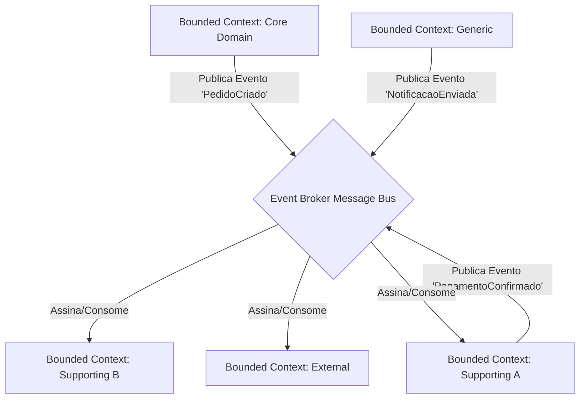
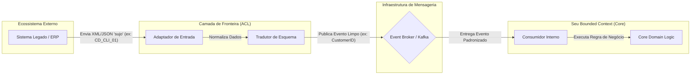
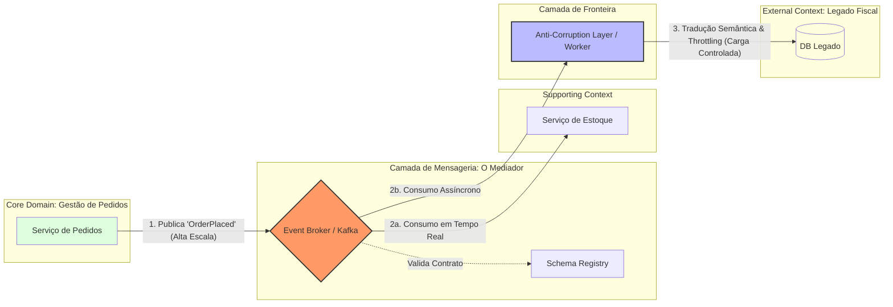

# WORKSHOP: Arquitetura Orientada a Eventos em Cenários de Alta Escala: Uma Análise de Padrões de Comunicação e Desacoplamento


## ⏱️ Workshop: EDA em Alta Escala (50 min)

### 1. Ponto de Partida: Context Mapping (10 min)

Utilizando a imagem fornecida como referência, traduzimos os domínios para um fluxo de eventos. O segredo da alta escala é o **Desacoplamento Temporal**: o emissor não espera o receptor.

**Mapeamento de Fluxo:**

* **Core Domain:** Emite eventos vitais (ex: `OrderPlaced`).
* **Supporting (A):** Reage para processar pagamentos ou validações.
* **Generic Subdomain:** Cuida de tarefas transversais como Notificações ou Logs.
* **External Context:** Sistemas legados ou APIs de terceiros que consomem dados via Webhooks/Adapters.

---

### 2. Análise de Padrões de Comunicação (15 min)

Para escalar, analisamos dois modelos principais de interação entre esses contextos:

| Padrão | Funcionamento | Nível de Desacoplamento |
| --- | --- | --- |
| **Coreografia** | Cada serviço observa o Broker e decide sua ação. | **Máximo.** Não há ponto central de falha lógica. |
| **Orquestração** | Um serviço central (Saga) comanda: "Execute A, depois B". | **Médio.** Facilita a visão do processo, mas cria dependência do orquestrador. |

**O Desafio da Alta Escala: Idempotência**
Em sistemas distribuídos, a rede falha. O padrão **At-least-once delivery** garante que a mensagem chegue, mas ela pode chegar repetida.

* **Solução:** O consumidor deve verificar se o ID da mensagem já foi processado antes de alterar o estado do banco.

---

### 3. Prática: Estrutura de Pastas e Implementação (20 min)

Para evitar que o código se torne um "Big Ball of Mud", a estrutura de pastas deve refletir o isolamento do Bounded Context e a infraestrutura de eventos.

**Estrutura de Pastas Sugerida:**

```text
/src
  /modules
    /sales-context (Core Domain)
      /domain
        /events        <-- Definição pura do evento (JSON Schema)
        /entities
      /application
        /handlers      <-- Lógica que dispara o evento
      /infrastructure
        /messaging     <-- Implementação (Kafka/RabbitMQ/AWS SNS)
        /outbox        <-- Persistência para garantir entrega (Outbox Pattern)
    /payment-context (Supporting A)
      /application
        /subscribers   <-- Escuta eventos do Sales Context

```

---

### 4. Conclusão e Trade-offs (5 min)

* **Vantagem:** Escalabilidade elástica. Se o `Supporting (A)` estiver lento, as mensagens acumulam no Broker sem derrubar o `Core Domain`.
* **Custo:** Consistência Eventual. O dado no `Generic Subdomain` pode estar alguns milissegundos (ou segundos) atrás do Core.

---

# MAPA DE CONTEXTO E FLUXO DE EVENTOS


Este diagrama é a representação visual de como transformamos um design estratégico de **Domain-Driven Design (DDD)** em uma arquitetura reativa e resiliente. O foco aqui não é apenas "enviar mensagens", mas sim garantir que a **lógica de negócio** dite como a tecnologia escala.

## 1. Os Atores: Bounded Contexts

Cada caixa quadrada representa um **Contexto Delimitado**. No DDD, isso significa que cada um possui seu próprio banco de dados, seus próprios modelos de objetos e sua própria equipe de desenvolvimento.

* **Core Domain:** É o coração do negócio (ex: o motor de vendas ou reservas). Em alta escala, ele deve ser protegido de lentidões em outros sistemas. Por isso, ele "fala e esquece": publica o evento e continua operando.
* **Supporting (A e B):** São domínios auxiliares (ex: Processamento de Pagamento ou Controle de Estoque). Eles dão suporte ao Core, mas não são o negócio principal.
* **Generic Subdomain:** Funcionalidades que não são exclusivas da empresa (ex: Envio de E-mails ou Logs). Podem ser substituídas por serviços de terceiros sem afetar a lógica central.
* **External:** Representa sistemas fora do seu controle (APIs de parceiros, sistemas legados ou ERPs externos).


## 2. O Mediador: Event Broker (O Losango Central)

O **Event Broker** (como Kafka, RabbitMQ ou Pulsar) atua como o sistema nervoso central.

* **Desacoplamento Espacial:** O `Core Domain` não sabe que o `External` existe. Ele apenas sabe que deve entregar a mensagem ao Broker.
* **Desacoplamento Temporal:** Se o `SuppB` estiver fora do ar por 5 minutos devido a um pico de carga, o Broker armazena as mensagens. Quando o serviço voltar, ele processa tudo o que perdeu sem que o usuário final perceba um erro no `Core`.


## 3. Dinâmica de Fluxo (Setas)

O diagrama utiliza o padrão **Pub/Sub (Publish/Subscribe)**, que é dividido em duas fases críticas:

### A. Fluxo de Publicação (Upstream)

As setas que apontam **para** o Broker representam a saída de fatos que já ocorreram:

1. O `Core` emite `PedidoCriado`.
2. O `SuppA` emite `PagamentoConfirmado`.
3. O `Generic` emite `NotificacaoEnviada`.

> **Ponto de Alta Escala:** Note que o `Core` não chama o `SuppA` via HTTP. Se o fizesse, e o `SuppA` estivesse lento, a transação do `Core` ficaria aberta, consumindo memória e CPU desnecessariamente.

### B. Fluxo de Assinatura/Consumo (Downstream)

As setas que saem **do** Broker representam a reação aos fatos:

1. O `SuppB` (ex: Logística) está "ouvindo" o Broker. Assim que o `PedidoCriado` aparece, ele começa a separar o pacote.
2. O `External` pode estar consumindo esses dados para alimentar um Dashboard de Business Intelligence em tempo real.
3. O `SuppA` (Pagamentos) pode consumir eventos de outros contextos para liberar estornos ou créditos.


## 4. Análise de Desacoplamento Técnica

Para que este diagrama funcione na prática de alta escala, aplicamos três conceitos:

1. **Imutabilidade:** Uma vez que o evento `PedidoCriado` saiu do `Core`, ele é um fato histórico. Não pode ser alterado, apenas compensado por outro evento (ex: `PedidoCancelado`).
2. **Fan-out:** O Broker permite que **um** evento (PedidoCriado) seja entregue simultaneamente para **N** interessados (Logística, BI, Notificação) sem que o emissor precise fazer N chamadas.
3. **Backpressure:** Se o sistema `External` for lento, ele consome as mensagens no seu próprio ritmo, sem "engasgar" a produção de mensagens dos outros contextos.

---

# BROKE E ACL

## Diagrama: O Fluxo da ACL no Mundo de Eventos




## Detalhamento dos Componentes da ACL

3 pontos vitais do diagrama:

### 1. O Adaptador (Interface de Entrada)

É o componente que "fala a língua" do vizinho. Se o sistema externo só envia arquivos CSV por FTP ou chamadas Webhook confusas, o **Adaptador** é quem recebe esse impacto. Ele isola a tecnologia de transporte externa da sua arquitetura.

### 2. O Tradutor (A Essência da ACL)

Aqui ocorre a **Tradução Semântica**.

* **De:** Um modelo de dados confuso, com nomes de campos técnicos ou em outra língua.
* **Para:** O seu **Linguagem Ubíqua** (ex: `OrderPlaced`, `ClientVerified`).
* **Importante:** Se o sistema externo mudar uma coluna no banco de dados deles, você só altera o **Tradutor**. Seu Core Domain nem percebe a mudança.

### 3. O Contrato no Broker

Uma vez que o dado passa pela ACL, ele entra no **Broker** seguindo um contrato rigoroso (Schema). Isso garante que qualquer outro serviço da sua empresa que consuma esse evento receba um dado confiável e de alta qualidade.


## Conclusão para o Workshop: O Broker é a ACL?

Como vimos, o **Broker é o canal de transporte seguro**, mas a **ACL é o "filtro"** que garante que apenas informações úteis e bem formatadas entrem nesse canal. Sem a ACL, seu Broker vira um "pântano de dados" (Data Swamp).

---

# DESAFIO BLACK FRIDAY




### 🧠 Guia de Leitura para os Participantes:

1. **O Mediador (Broker):** Funciona como o amortecedor. Ele aceita 10k pedidos por segundo do **Core Domain**, mesmo que os outros sistemas sejam lentos.
2. **A Dinâmica de Fluxo:** * O **Estoque** consome as mensagens rapidamente (escala paralela ao Core).
* A **ACL** consome as mesmas mensagens, mas atua como um "redutor de velocidade" (Throttling) para não derrubar o **Legado Fiscal**.

3. **A ACL em Ação:** Observe que ela é a única que "toca" o sistema legado. Ela traduz os dados modernos do seu sistema para o formato esperado pelo banco de dados antigo (ex: convertendo JSON para a estrutura de campos em latim).

Este exercício foi desenhado para ser a "prova de fogo" do workshop. Ele força os participantes a saírem da teoria e tomarem decisões arquiteturais reais de **alta escala**, focando em como o **Broker** e a **ACL** protegem o domínio.

---

## 🕒 Exercício Prático: O Desafio da Black Friday (20 min)

### O Cenário

A empresa **"Global-Log"** possui um sistema de **Gestão de Pedidos (Core Domain)**. Durante a Black Friday, o volume de vendas aumenta 50x. Atualmente, o sistema de pedidos tenta avisar o **Sistema de Notas Fiscais (Externo/Legado)** via API síncrona, mas o Legado trava com o volume, derrubando as vendas.

### O Material de Partida

Os participantes recebem o seguinte mapeamento de contexto simplificado:

1. **Core Domain (Pedidos):** Gera 10k eventos/seg. Não pode esperar ninguém.
2. **External Context (Legado Fiscal):** Só aguenta 100 requisições/seg. Usa nomes de campos em latim (ex: `id_venditio`).
3. **Supporting Context (Estoque):** Precisa saber das vendas para baixar o inventário.


### A Tarefa (Trabalho em Grupo ou Individual)

Os participantes devem desenhar (em papel ou ferramenta digital) e justificar:

#### 1. Propor o Mediador (5 min)

* Qual tecnologia/padrão de **Broker** escolheriam para suportar esse "buffer" de mensagens?
* Como garantir que o **Core Domain** não fique travado esperando o **Legado**?

#### 2. Desenhar a Dinâmica do Fluxo e ACL (10 min)

* Onde exatamente você colocaria a **ACL** (Anti-Corruption Layer)?
* Desenhe o fluxo da mensagem desde a criação do pedido até a chegada no Legado, indicando a transformação dos dados (Tradução).
* Como o **Estoque** se encaixa nesse fluxo sem acoplar com o **Legado**?

#### 3. Definir a Estratégia de Escala (5 min)

* Se o **Legado** cair por 2 horas, o que acontece com as mensagens no Broker?
* Como evitar que o **Legado** processe a mesma nota fiscal duas vezes (Idempotência)?


## 📝 Guia de Resolução (Para o Facilitador)

Ao final dos 20 minutos, apresente esta solução esperada para comparação:

* **O Mediador:** Um Broker com suporte a **Backpressure** (ex: Kafka ou RabbitMQ com filas persistentes). O Core publica e esquece.
* **A ACL:** Deve ficar na frente do **Legado**. Ela consome do Broker, traduz os nomes dos campos (de `OrderID` para `id_venditio`) e faz o "Throttling" (entrega as mensagens devagar, no ritmo que o legado aguenta).
* **O Fluxo:** * `Pedido` -> `Broker` (Evento: `OrderPlaced`)
* `Broker` -> `Estoque` (Consome em tempo real)
* `Broker` -> `ACL` -> `Legado Fiscal` (Consome de forma controlada/lenta)

### Checklist de Avaliação para os Participantes

> * [ ] O Core Domain ficou livre de chamadas HTTP externas?
> * [ ] O Legado está protegido por uma camada de tradução (ACL)?
> * [ ] O sistema aguenta a queda de um dos componentes sem perder dados?
> 
> 

**Gostaria que eu gerasse um template de "Resumo Executivo" para os participantes preencherem as respostas deste exercício?**

---

